# Graphify형 지식그래프 검색 — Phase 1 PoC 설계서

> 범위: PoC only · 데이터: 50~100개 문서(xlsx/docx/pdf/md)
> 작성일: 2026-06-22 (개정: LLM 선택 기능 추가)

---

## 1. PoC 목표 & 범위

### 1.1 목표
- 소규모 문서(50~100개)로 **온톨로지·추출 파이프라인의 실현 가능성** 검증
- Neo4j에 지식그래프 적재 후 **KG 기반 검색**이 의미 있게 동작하는지 확인
- 사용자/관리자 두 탭으로 **end-to-end 흐름**(업로드 → 그래프화 → 검색 → 답변) 시연

### 1.2 In Scope (PoC에 포함)
- 4종 형식(xlsx/docx/pdf/md) 파싱 + 엔티티·관계 추출
- 도메인 온톨로지(스키마) 초안 정의 및 검증
- **웹 UI를 통한 문서 업로드 → Neo4j 적재** (비동기 처리 + 상태 추적)
- Neo4j 적재 + KG 기반 검색(자연어 → Cypher → 답변)
- **LLM**: NL→Cypher 생성 및 답변 생성에 **HCX-30B-Text (hcx-agent-05)** 단일 모델 사용
  - (과거 Qwen3.6 · HyperCLOVA X · Claude Opus 4.8 선택 옵션이 있었으나 **모델 관리 부담으로 제거**, 2026-07-20)
- **관리자 탭**: 문서 업로드, 업로드 문서 리스트(상태 표시), 그래프 뷰
- **사용자 탭**: 검색 프롬프트 입력, 답변 확인, 생성된 Cypher 쿼리 뷰

### 1.3 Out of Scope (PoC에서 제외 — Phase 2 이후)
- 커뮤니티 요약(글로벌 질의), 대규모 확장/증분 업데이트
- 정교한 패싯 필터, 권한(ACL) 기반 검색, 멀티 유저 인증
- 고급 엔티티 해소 자동화(PoC는 규칙+수동 검수 수준)
- 운영 모니터링 대시보드, CI/CD, 고가용성 인프라

---

## 2. PoC 전체 구조

```
[관리자 탭]                          [사용자 탭]
 문서 업로드(웹 UI)                   자연어 질문 + 모델 선택
    │                                    │
    ▼                                    ▼
 ┌──────────────────┐            ┌──────────────────────┐
 │ Ingestion Pipeline│            │ LLM 라우터(모델 선택)  │
 │ 파싱→추출→적재     │◀─ LLM ─▶  │ NL→Cypher + 답변 생성  │
 │ (백그라운드 작업)  │            │ + KG 검색             │
 └──────────────────┘            └──────────────────────┘
    │                                    │
    ▼                                    ▼
        ┌───────────────────────────────────┐
        │            Neo4j (KG)              │
        │   엔티티 · 관계 · 출처(청크) 메타   │
        └───────────────────────────────────┘
            │                       │
       그래프 뷰(관리자)        답변 + Cypher 뷰(사용자)

      ┌──────────── LLM Provider Layer ────────────┐
      │  HCX-30B-Text (사내 게이트웨이, 기본)       │
      │  Qwen3.6 · HyperCLOVA X · Claude Opus 4.8   │
      └────────────────────────────────────────────┘
```

핵심 단순화: PoC에서는 **벡터 인덱스 없이도** 시작 가능. 1차로 "자연어 → Cypher 생성 → 그래프 조회 → 답변" 경로만 구현하고, 검색 품질이 부족하면 벡터 검색을 보조로 추가한다.

---

## 3. 데이터 파이프라인 (웹 UI 업로드 → Neo4j 적재)

### 3.1 처리 흐름
1. **업로드(웹 UI)**: 관리자가 파일 업로드(드래그앤드롭/다중) → 형식 검증 → 객체 저장(로컬/MinIO) + 메타 기록
2. **비동기 처리 트리거**: 업로드 즉시 응답을 반환하고, **백그라운드 작업**으로 파싱→추출→적재를 수행
   (LLM 추출은 느리므로 동기 처리하면 UI가 멈춤 → BackgroundTasks/작업 큐 사용)
3. **파싱(형식별)**
   - md: 헤더 기반 청킹
   - docx: python-docx, Heading 기반 청킹 + 표 분리
   - pdf: PyMuPDF/Unstructured, 필요 시 OCR + 표 분리
   - xlsx: pandas로 표→레코드 추출(결정적 매핑)
4. **추출**
   - 비정형 텍스트: LLM(`LLMGraphTransformer` 등)으로 (노드, 관계, 속성) 추출, 스키마 제약
   - 정형 표(xlsx): 시트→엔티티, 컬럼→속성/관계, 행→인스턴스 규칙 매핑
5. **정규화**: 엔티티명 표준화, 중복 후보 병합(PoC는 문자열+임베딩 유사도 임계값 + 수동 확인)
6. **적재**: Neo4j `MERGE`로 노드/관계 적재(멱등), 각 노드/엣지에 `source_file`·`chunk_id` 부착
7. **상태 갱신**: 문서별 처리 상태를 관리자 리스트에 반영

### 3.2 문서 처리 상태(라이프사이클)
```
uploaded → parsing → extracting → loading → completed
                                         └─→ failed (오류 메시지 보존)
```
- 각 단계 전이를 메타 저장소(SQLite/PostgreSQL)에 기록
- UI는 `/admin/documents`를 **폴링**(예: 2~3초)하여 상태/진행률 갱신
- 실패 시 오류 메시지 노출 + "재처리(reprocess)" 액션 제공

### 3.3 멱등성 & 삭제
- **재업로드/재처리**: `source_file`을 키로 기존 노드·엣지를 먼저 제거 후 재적재 → 중복 방지
- **삭제**: 문서 삭제 시 `MATCH ()-[r]-() WHERE r.source_file = $f DELETE r` + 고아 노드 정리

### 3.4 PoC 온톨로지(스키마) 초안
> 실제 문서(`graph_output/GRAPH_REPORT.md`의 god-node/community)를 보고 1~2회 조정. 처음엔 단순하게.

```
노드(:Entity): id, label, norm_label, file_type, source_file, community
관계(:REL): relation(has_class/has_property/references/applies_to/form 등),
            confidence, confidence_score, source_file, weight
```

> 갱신(2026-06-30): 구조화 사실은 위 개념 그래프와 별개로 **고정 화이트리스트 etype 7종**
> (Product·RateGrade·Nego·Decision·VehicleCondition·HandlingRule·Term)으로 적재한다(`origin='structured'`).
> **TBox(온톨로지) / ABox(인스턴스)** 관점의 스키마 도식은 아래와 같다. 상세는 `08_구조화사실_그래프_상세.md`.



---

## 4. 검색 (사용자 탭 백엔드)

### 4.1 흐름 (NL → Cypher → 답변)
1. 사용자 자연어 질의 입력 + **사용 모델 선택**(기본 HCX-30B-Text)
2. 선택된 LLM이 **스키마를 주입받아 Cypher 쿼리 생성** (LangChain `GraphCypherQAChain` 등)
3. 생성된 Cypher를 Neo4j에 실행(읽기 전용) → 결과(노드/관계/행) 획득
4. 결과를 컨텍스트로 **동일 LLM이 자연어 답변 생성**(출처 문서 인용 포함)
5. 응답으로 ① 답변 텍스트 ② 실행된 Cypher 쿼리 ③ 사용 모델명 ④ (선택) 결과 서브그래프 반환

### 4.2 안정성 장치 (PoC 수준)
- Cypher 생성 시 스키마/예시 few-shot 주입으로 오류 감소
- 읽기 전용 쿼리만 허용(쓰기/삭제 키워드 차단)
- 쿼리 실패 시 재생성 1회 또는 "답변 불가" 안내
- 환각 억제: "그래프 결과에 없으면 모른다고 답하라" 가드레일

### 4.3 LLM 선택 기능 (신규)

**목표**: 같은 질의를 서로 다른 모델로 실행·비교할 수 있게 하여, 한국어 도메인 질의에서 어떤 모델이 더 정확한 Cypher·답변을 내는지 PoC에서 검증한다.

**모델 레지스트리(초기)**

| 모델 ID | 표시명 | Provider | 호출 방식 | 비고 |
|---|---|---|---|---|
| `hcx30` | HCX-30B-Text (`hcx-agent-05`) | 사내 게이트웨이(OpenAI 호환) | `ChatOpenAI` + `extra_body` | **유일 운영 모델**. `chat_template_kwargs.thinking=true` 전달 |

> 갱신 이력: 기본 모델 Claude → Qwen3.6 → HCX-30B-Text(2026-06-30).
> **2026-07-20: 모델 관리 부담으로 Qwen·HyperCLOVA X·Claude를 제거하고 HCX-30B-Text 단일 운영으로 정리.**
> 다시 늘리려면 `registry.py`의 `MODELS`에 1줄 추가로 등록(확장성 유지).

**추상화 설계**
- 모델별 설정을 **레지스트리(registry)** 로 분리하고, `model_id`로 LangChain Chat 모델을 생성하는 **팩토리(factory)** 를 둔다.
- NL→Cypher 단계와 답변 생성 단계 모두 **동일하게 선택된 모델**을 사용(일관성·비교 용이).
- 새 모델 추가는 레지스트리에 항목 1개 추가로 끝나도록 설계(확장성).
- HyperCLOVA X Think는 **thinking(추론) 모드** 파라미터 지원 → Cypher 생성 정확도 향상 기대(필요 시 effort 조절).

**API/UI 연동**
- `GET /models`로 사용 가능 모델 목록 제공 → 사용자 탭 드롭다운에 표시(기본 선택: HCX-30B-Text)
- `POST /search`에 `model` 파라미터 추가 → 미지정 시 기본 모델 사용
- 응답에 `model_used` 포함 → UI에 "이 답변은 ○○ 모델로 생성" 표시

**비밀값/설정**
- Anthropic: `ANTHROPIC_API_KEY`
- CLOVA Studio: `CLOVA_API_KEY`(+ 필요 시 `CLOVA_APIGW_KEY`/엔드포인트), 자체호스팅 시 `HCX_BASE_URL`
- 모두 `.env`에만 보관(커밋 금지)

### 4.4 컨텍스트 구성 원칙 — 검색 품질의 핵심 ★ (2026-06-30)

> **정밀 검색 ≠ 정답. 정답은 컨텍스트 구성에서 완성된다.** 답변 정확도는 검색된 근거를
> **무엇을 · 어떤 순서로 · 어떤 권위로** LLM 컨텍스트에 담느냐에 크게 좌우된다.

- **문제** — 구조화 사실(그래프)이 저품질·부분적·주변적이면 청크 원문의 뉘앙스를 가려 **오답**을 낸다.
  예) "프로모션 법인 가능?"의 정답 조건 `(개인고객 限)`은 청크에만 있는데, 앞자리에 놓인 부정확한 fact가
  LLM을 끌어당겨 반대로 답함. (원인: ① 앞자리 배치 ② "사실" 권위 ③ 추출 손실·매칭 노이즈)
- **대응(구현됨)**
  1. **저점수 fact 컷**(`score ≥ 3`, 상위 8) — 주변적 매칭 제외.
  2. **문서 발췌를 1차 근거로 앞에**, 구조화 사실은 **보조로 뒤에**(컨텍스트 라벨에 "발췌와 상충 시 발췌 우선" 명시).
  3. **비교 뷰 Hybrid = 기본 검색 동일 파이프라인**(구조화 사실은 검색방식과 무관하게 동일 적용).
- **원칙** — 1차 근거는 **원문(청크)**, 그래프 사실은 **정밀값·검증 보조**. 구조화는 정밀도를 *보강*하되 원문을 *대체하지 않음*.

---

## 5. UI 설계

### 5.1 관리자 탭

```
┌─────────────────────────────────────────────────────────┐
│  [사용자] [관리자*]                                       │ ← 탭 전환
├─────────────────────────────────────────────────────────┤
│  📤 문서 업로드                                            │
│  ┌───────────────────────────────────────────────┐      │
│  │  파일을 끌어다 놓거나 클릭하여 업로드           │      │
│  │  (xlsx, docx, pdf, md)                          │      │
│  └───────────────────────────────────────────────┘      │
│                                                          │
│  📋 업로드된 문서 리스트 (2~3초 폴링으로 상태 갱신)       │
│  ┌──────────┬────────┬──────────────┬──────────┐        │
│  │ 파일명    │ 형식   │ 상태         │ 처리일   │        │
│  ├──────────┼────────┼──────────────┼──────────┤        │
│  │ 정책.pdf  │ pdf    │ ✅완료       │ 06-22    │        │
│  │ 상품.xlsx │ xlsx   │ ⏳추출중     │ 06-22    │        │
│  │ 안내.md   │ md     │ ❌실패(사유) │ 06-22    │        │
│  └──────────┴────────┴──────────────┴──────────┘        │
│  [재처리] [삭제]                                          │
│                                                          │
│  🕸 그래프 뷰 (적재된 KG 전체/문서별)                     │
│  ┌───────────────────────────────────────────────┐      │
│  │        ○──○                                     │      │
│  │       /    \      [노드 클릭 → 속성·출처 표시]  │      │
│  │      ○      ○──○                                │      │
│  └───────────────────────────────────────────────┘      │
└─────────────────────────────────────────────────────────┘
```

**기능**
- 드래그앤드롭/클릭 업로드(다중 파일), 형식 검증, 업로드 즉시 리스트 반영(상태 uploaded)
- 문서 리스트: 파일명·형식·처리상태(라이프사이클)·처리일, **삭제/재처리** 액션, 실패 사유 표시
- 그래프 뷰: 전체 KG 또는 특정 문서 기준 서브그래프, 노드 클릭 시 속성·출처 표시, 줌/팬/드래그

### 5.2 사용자 탭

```
┌─────────────────────────────────────────────────────────┐
│  [사용자*] [관리자]                                       │
├─────────────────────────────────────────────────────────┤
│  🤖 모델: [ HCX-30B-Text ▼ ]  ← HCX-30B / Qwen3.6 /       │
│                                  HyperCLOVA X / Claude     │
│  🔍 [ 무엇이든 물어보세요 ..................... ] [검색]  │
│                                                          │
│  💬 답변                            (생성 모델: Opus 4.8) │
│  ┌───────────────────────────────────────────────┐      │
│  │ 듀얼상품은 금리등급 ○등급까지 취급 가능합니다…  │      │
│  │ 출처: 9_샘플_중고승용 상품운영기준.pdf          │      │
│  └───────────────────────────────────────────────┘      │
│                                                          │
│  🧩 생성된 Cypher 쿼리                            [복사]  │
│  ┌───────────────────────────────────────────────┐      │
│  │ MATCH (e:Entity)-[r:REL]-(n) WHERE ...          │      │
│  └───────────────────────────────────────────────┘      │
│                                                          │
│  (선택) 🕸 결과 서브그래프                                │
└─────────────────────────────────────────────────────────┘
```

**기능**
- **모델 선택 드롭다운**(기본 HCX-30B-Text) → 선택 모델로 검색 실행
- 자연어 프롬프트 입력 → 답변 표시(출처 인용, 사용 모델명 표기)
- 실행된 Cypher 쿼리 표시(투명성·디버깅용) + 복사 버튼
- (선택) 답변 근거가 된 결과 서브그래프 표시

---

## 6. 기술 스택 (PoC 최소 구성)

| 영역 | 기술 | 비고 |
|---|---|---|
| 프론트엔드 | React + TypeScript + Tailwind | 탭 2개, 단일 SPA |
| 그래프 렌더 | Cytoscape.js | PoC 규모(수천 노드 이하)에 적합·분석기능 풍부 |
| 백엔드 | FastAPI (Python) + BackgroundTasks | 비동기 적재, LLM/그래프 생태계 친화 |
| KG 저장소 | Neo4j (리모트 서버) | Cypher 조회, 필요시 네이티브 벡터 |
| 메타 저장 | SQLite(PoC) | 문서 처리 상태/라이프사이클 |
| 파싱 | pandas/openpyxl(xlsx), python-docx(docx), PyMuPDF/Unstructured(pdf), 마크다운 파서(md) | 형식별 분기 |
| 추출/검색 | LangChain (`LLMGraphTransformer`, `GraphCypherQAChain`) | NL→Cypher |
| **LLM(선택형)** | 기본 **HCX-30B-Text(hcx-agent-05)** · **Qwen3.6-35B-A3B** · **HyperCLOVA X Think 32B**(사내 게이트웨이, OpenAI 호환) · **Claude Opus 4.8**(`langchain-anthropic`) | 레지스트리+팩토리로 추상화, UI 선택 |
| 저장/인프라 | 로컬 파일 or MinIO | PoC는 단순하게 |

---

## 7. API 초안

| 메서드 | 경로 | 설명 |
|---|---|---|
| GET | `/health` | 헬스체크 |
| GET | `/models` | 사용 가능 LLM 목록(기본 모델 표시) |
| POST | `/admin/upload` | 파일 업로드 → 비동기 파이프라인 트리거 |
| GET | `/admin/documents` | 업로드 문서 리스트 + 처리 상태(폴링 대상) |
| POST | `/admin/documents/{id}/reprocess` | 문서 재처리 |
| DELETE | `/admin/documents/{id}` | 문서 삭제(+그래프 정리) |
| GET | `/admin/graph?doc_id=` | 전체/문서별 그래프 데이터(노드·엣지) |
| POST | `/search` | 자연어 질의(+`model`) → {answer, cypher, rows, model_used} |
| GET | `/node/{id}` | 노드 상세(속성·출처) |

---

## 8. PoC 추진 순서(제안)

1. **환경 세팅** (1주): Neo4j(리모트 연결), FastAPI 스캐폴드, React 탭 구조, LLM 레지스트리/키 설정
2. **파이프라인** (1~2주): 4종 파서 → 추출 → Neo4j 적재(비동기·상태추적), 온톨로지 1차 검증
3. **검색 + 모델 선택** (1주): NL→Cypher→답변, 읽기전용 가드레일, 모델 팩토리/`/models`/`/search` 연동
4. **UI 연결** (1~2주): 관리자(업로드/리스트/상태폴링/그래프), 사용자(모델선택/검색/답변/Cypher 뷰)
5. **검증·튜닝** (1주): 샘플 질의셋으로 **모델별 정확도 비교**, 온톨로지/프롬프트 조정

> 예상: 약 5~7주 (인력·문서 복잡도에 따라 변동)

---

## 9. PoC 성공 기준(예시)

- 웹 UI 업로드 → 50~100개 문서가 오류 없이 그래프로 적재됨(형식 4종 모두), 상태가 UI에 정확히 반영
- 준비된 샘플 질의 N개 중 일정 비율 이상에서 정답 또는 근거 있는 답변
- 사용자 탭에서 답변과 함께 Cypher가 정상 표시·실행됨
- **모델 선택(HCX-30B ↔ Qwen3.6 ↔ HyperCLOVA X ↔ Claude)이 UI에서 전환되고, 각 모델로 검색이 정상 수행**
- 관리자 탭에서 업로드→리스트→그래프 뷰 흐름이 끊김 없이 동작

---

## 10. PoC 단계 핵심 리스크

| 리스크 | 대응 |
|---|---|
| 추출 품질 편차(특히 pdf 표/스캔) | OCR·표 분리, 온톨로지 단순화, 샘플 검수 |
| NL→Cypher 오류 | 스키마/예시 few-shot, 읽기전용 제한, 실패 시 폴백 |
| 엔티티 중복/불일치 | 정규화 규칙 + 수동 검수(PoC 허용 수준) |
| 한국어 추출/답변 품질 | 한국어 검증 모델(HyperCLOVA X) 선택지 제공, 프롬프트 한국어 최적화 |
| LLM 비용·지연 | 모델 선택으로 용도별 분리, 긴 추출은 비동기 처리 |
| 모델별 응답 포맷 차이 | 팩토리에서 표준 인터페이스로 통일, Cypher 파싱 방어코드 |
| API 키/엔드포인트 관리 | `.env` 분리, 키 누락 시 해당 모델 비활성(드롭다운에서 제외) |
```